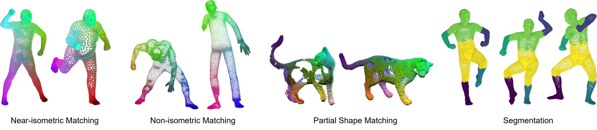

# CoE: Deep Coupled Embedding for Non-Rigid Point Cloud Correspondences

This repository contains the code for the paper  
[CoE: Deep Coupled Embedding for Non-Rigid Point Cloud Correspondences](https://arxiv.org/abs/2412.05557)

### This code is under construction. The final version of code will be released soon.

## Installation

- Ubuntu 20.04
- Python 3.8

We recommand you install necessary dependencies by conda:
```
conda create -n coe python=3.8
conda activate coe 
conda install pytorch cudatoolkit -c pytorch 
pip install -r requirements.txt 
```

## Data 
Please download the datasets from the following links:
- [FAUST](https://drive.google.com/file/d/1ISqBLo6twUILJ9CbH3Kh34kEikGzRDlY/view?usp=sharing)
- [SCAPE](https://drive.google.com/file/d/1Q0O-v8LUpXJDazHmcKjW50Md4CEUYrQL/view?usp=sharing)
- [SURREAL](https://drive.google.com/file/d/1D_FHv7UHHbcXquCR-BYs1w5PJiwtqgkY/view)

and put them in the `./data` folder.

The data is organized as follows:
```bash
├── data
    ├── FAUST
        ├── off
        ├── corres
    ├── SCAPE
        ├── off
        ├── corres
...
```

We extend our gratitude to the original dataset providers for their valuable contributions and we acknowledge that full credit belongs to the original authors.

## Training 

```python
python train.py --config config/scape.json
```

The pre-computation will be performed automatically and saved in `input` folder. 

The training process will be saved in the `saved` folder.

## Evaluation

```python
python test.py --config config/scape_test.json -d scape -m checkpoints/scape.pth
```

The evaluation results will be saved in a subfolder under the model path.
## Pretrained Models

We provide pretrained models for the FAUST, SCAPE and SURREAL dataset. You can find the model in the `checkpoints` folder.

## Visualization

We provide the visualization code in the `visualization` folder. You can visualize the correspondence results by running the following command:

```python
python visualization/correspondence.py
```

## Acknowledgement

The implementation of DiffusionNet is modified from [the official implementation](https://github.com/nmwsharp/diffusion-net).

The cross-attention block is modified from [DPFM](https://github.com/pvnieo/DPFM).

The LBO computation is modified from [SSMSM](https://github.com/dongliangcao/Self-Supervised-Multimodal-Shape-Matching/tree/main).

We thank the authors for making their codes publicly available.
## Citation

If you find the code is useful, please cite the following paper

```bibtex
@inproceedings{zeng2024,
    title = {{CoE}: Deep Coupled Embedding for Non-Rigid Point Cloud Correspondences},
    author = {Zeng, Huajian and Gao, Maolin and Cremers, Daniel},
    booktitle = {International Conference on 3D Vision (3DV)},
    month = {March},
    year = {2025},
}
```
